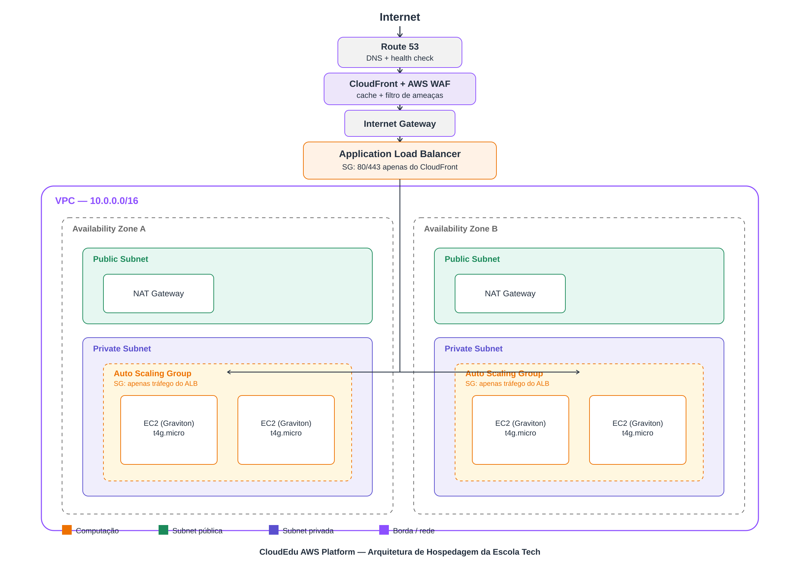
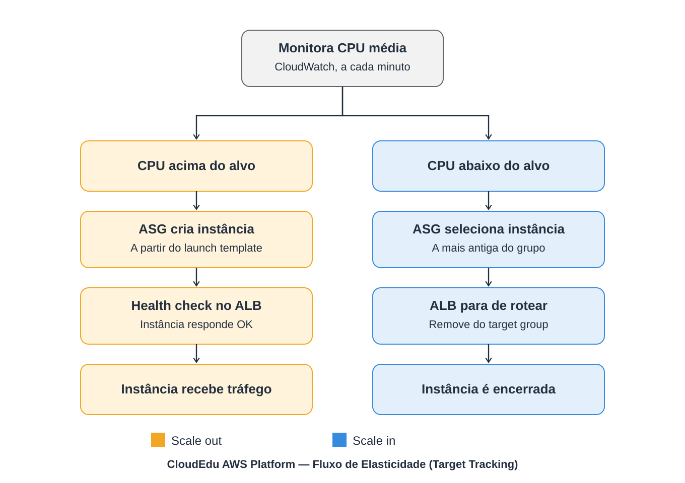

[README.md](https://github.com/user-attachments/files/30143556/README.md)
# CloudEdu AWS Platform (docs/docs/Copilot_20260722_014221.png)

Projeto de Trabalho de Conclusão de Curso (TCC) — Escola da Nuvem, Team 3.

Solução de infraestrutura em nuvem para hospedagem resiliente e elástica da página de matrículas da **Escola Tech**, uma plataforma fictícia de cursos online, construída sobre a AWS.

## 📋 Descrição do problema

A Escola Tech enfrentava indisponibilidade recorrente do site de matrículas durante campanhas de marketing em redes sociais, quando o volume de acessos simultâneos excedia a capacidade do servidor local. O projeto propõe uma arquitetura que resolve três requisitos centrais:

- **Resiliência**: o site não pode cair mesmo que um data center da AWS falhe.
- **Elasticidade**: a capacidade deve crescer automaticamente em picos de tráfego e reduzir em períodos ociosos.
- **Custo controlado**: pagar apenas pela capacidade efetivamente utilizada.

## 🏗️ Arquitetura da solução



O tráfego passa primeiro por uma camada de borda (**Route 53** + **CloudFront** + **AWS WAF**), que resolve o DNS, faz cache de conteúdo estático e filtra ameaças antes de chegar ao **Application Load Balancer**. O ALB direciona as requisições para instâncias **EC2** gerenciadas por um **Auto Scaling Group**, replicadas em duas **Availability Zones** dentro de uma **VPC** segmentada em subnets públicas e privadas. Os dados ficam no **RDS** (registros acadêmicos) e no **S3** (materiais didáticos e assets estáticos do site).

| Componente | Serviço AWS | Função |
|---|---|---|
| DNS | Route 53 | Resolução de DNS com health check do endpoint público |
| Borda / cache / segurança | CloudFront + AWS WAF | Absorve picos de tráfego, cacheia conteúdo estático, filtra ameaças |
| Balanceamento de carga | Application Load Balancer | Distribui tráfego HTTP/HTTPS e executa health checks |
| Computação | EC2 (Graviton) + Auto Scaling Group | Hospeda a aplicação; escalonamento por Target Tracking, Scheduled e Predictive Scaling |
| Rede | VPC multi-AZ | Isola subnets públicas e privadas em 2 AZs, com NAT Gateway por AZ |
| Dados | RDS (Multi-AZ) + S3 | Persistência de registros acadêmicos e armazenamento de arquivos |
| Segurança | Security Groups em camadas + IAM + Secrets Manager | ALB aceita apenas o CloudFront; EC2 aceita apenas o ALB; credenciais nunca em texto puro |

Documentação detalhada de cada decisão em [`docs/decisoes-tecnicas.md`](docs/decisoes-tecnicas.md).

### Fluxo de elasticidade



O Auto Scaling Group usa uma política de target tracking baseada em utilização média de CPU: cria instâncias quando a demanda sobe e as remove — somente após o Load Balancer parar de rotear tráfego para elas — quando a demanda cai.

## 💰 Estimativa de custos

Estimativa mensal aproximada (região us-east-1, tráfego moderado). Detalhamento completo em [`docs/custos.md`](docs/custos.md).

| Componente | Custo estimado |
|---|---|
| EC2 (2 a 6 instâncias t3.micro) | US$ 15 – 20 |
| Application Load Balancer | US$ 22 – 28 |
| NAT Gateway | US$ 33 |
| **Total aproximado** | **US$ 75 – 90/mês** |

> Valores de referência. Recomenda-se validar com o [AWS Pricing Calculator](https://calculator.aws/) antes de qualquer implantação real.

## 🔒 Segurança

- Security Groups seguindo o princípio do menor privilégio (ALB expõe 80/443 à internet; EC2 só aceita tráfego do ALB).
- [ ] IAM roles com permissões mínimas necessárias — *pendente de documentação*
- [ ] Credenciais via variáveis de ambiente / Secrets Manager — *pendente*

## 🚀 Como reproduzir

### Pré-requisitos

- Conta AWS ativa
- AWS CLI configurado
- *(preencher: Terraform / CloudFormation, se aplicável)*

### Passo a passo

1. Clone este repositório
2. Configure as variáveis de ambiente com base em `.env.example`
3. *(preencher conforme o método de implantação escolhido: console manual, CloudFormation ou Terraform)*
4. Acesse a aplicação pelo DNS do Load Balancer, disponível no console EC2

## 📁 Estrutura do repositório

```
├── docs/
│   ├── arquitetura/          # diagramas da solução
│   ├── decisoes-tecnicas.md  # justificativa das escolhas técnicas
│   └── custos.md             # estimativa de custos detalhada
├── infraestrutura/           # scripts de IaC (CloudFormation/Terraform)
├── README.md
└── .env.example
```

## 🧑🏻‍💻 Autores

Desenvolvido pelo **Team 3** — Escola da Nuvem:

- Vagner Tomaz dos Santos
- Jefferson Da Mata Dos Reis
- Daniel Victor Moreira Braga
- Evandro Gomes Lemos
- Daniel Tadao Silva Shimada
- Marcos Roberto De Andrade

## 📄 Licença

*(definir, se aplicável)*
