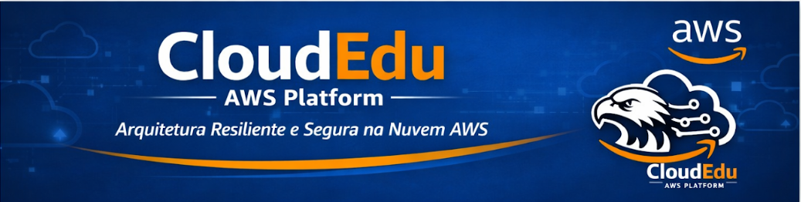
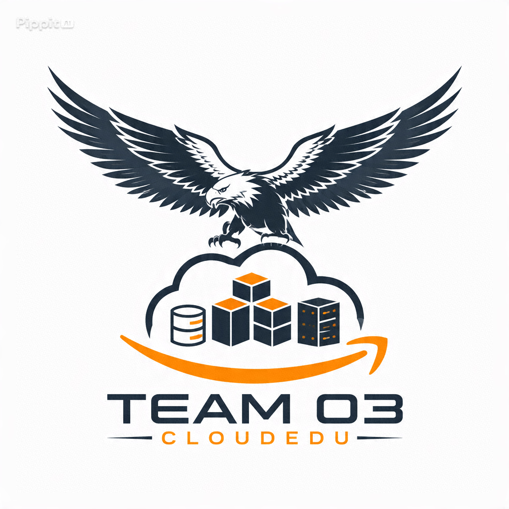
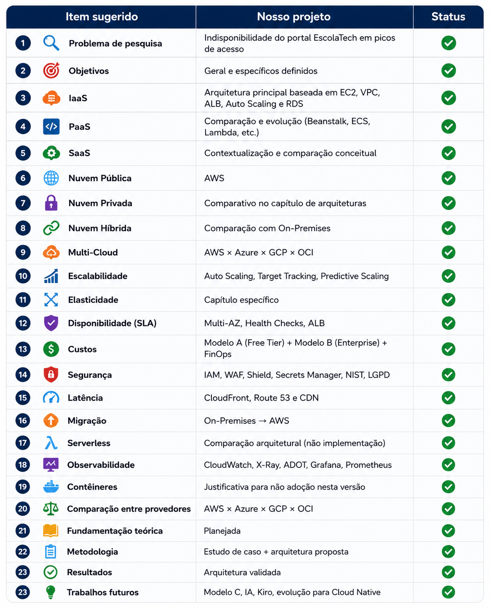
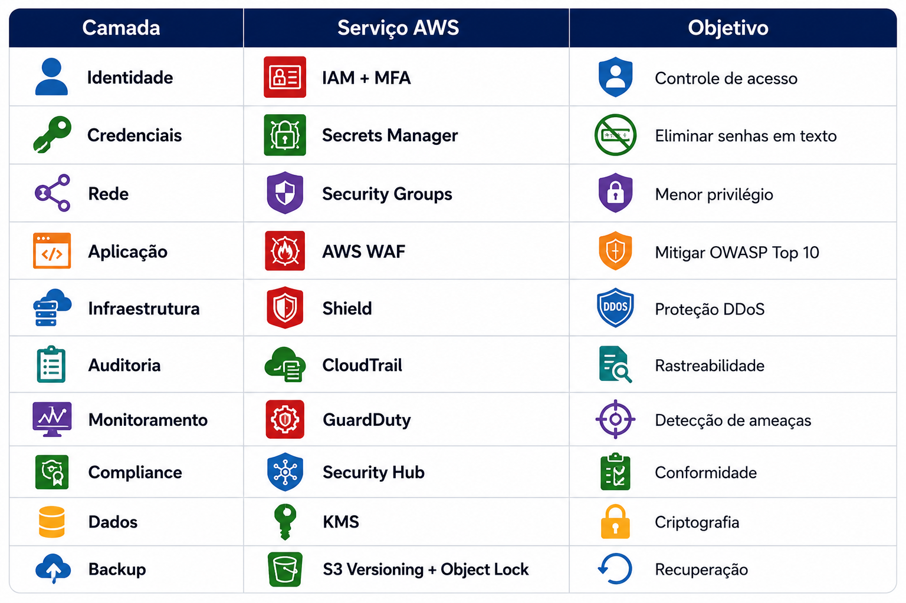
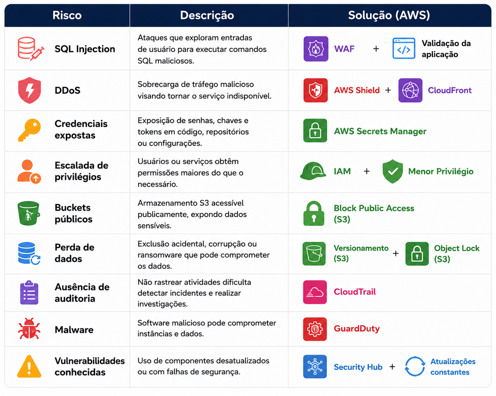

<div align="center">



### Projeto de Trabalho de Conclusão de Curso (TCC) 

Arquitetura de referência em Amazon Web Services (AWS) para hospedagem resiliente, escalável, segura e otimizada em custos da plataforma fictícia **Escola Tech**, desenvolvida para suportar grandes campanhas de matrícula com alta disponibilidade e excelente experiência do usuário.


</div>

[]()
[]()
[]()
[]()
[]()
[]()

---

## 📖 Resumo Executivo
O CloudEdu AWS Platform, desenvolvido pelo Team 3 da Escola da Nuvem, apresenta uma arquitetura de referência em Amazon Web Services (AWS) para a plataforma fictícia Escola Tech.
O objetivo é demonstrar como a nuvem pode oferecer alta disponibilidade, elasticidade, segurança em múltiplas camadas, observabilidade e controle de custos em cenários de grande demanda.



**O projeto contempla dois cenários complementares:**

Modelo A (Free Tier / Acadêmico): explora a viabilidade de construir uma solução funcional na AWS utilizando créditos e serviços gratuitos, sem custo inicial.

Modelo B (Enterprise): simula um ambiente corporativo com orçamento controlado de R$ 2.000/mês, ajustável em períodos críticos de matrícula e rematrícula, assegurando previsibilidade tecnológica e financeira.


---


## ✅ Conformidade com Frameworks

A adoção dos principais frameworks de arquitetura, segurança, operações e governança demonstra que o CloudEdu AWS Platform foi projetado seguindo boas práticas reconhecidas pelo mercado. Essa abordagem aumenta a qualidade técnica da solução, reduz riscos operacionais e facilita sua evolução para ambientes corporativos.


| Framework | Status |
|---|:---:|
| AWS Well-Architected Framework | ✅ |
| AWS Cloud Adoption Framework (CAF) | ✅ |
| FinOps Foundation | ✅ |
| DevOps | ✅ |
| SRE | ✅ |
| LGPD | ✅ |
| NIST Cybersecurity Framework | ✅ |
| Observabilidade | ✅ |


Benefícios Globais da Adoção desses Frameworks
A combinação desses frameworks proporciona benefícios estratégicos para o projeto e para a organização, entre eles:
Arquitetura alinhada às melhores práticas internacionais.
Maior disponibilidade e confiabilidade da aplicação.
Escalabilidade e elasticidade para suportar picos de acesso.
Segurança em múltiplas camadas, reduzindo riscos cibernéticos.
Governança mais eficiente dos recursos em nuvem.
Controle financeiro baseado nos princípios do FinOps.
Monitoramento contínuo e resposta rápida a incidentes.
Conformidade com requisitos regulatórios, como a LGPD.
Facilidade de manutenção, evolução e expansão da infraestrutura.
Base preparada para adoção futura de arquiteturas Cloud Native, microsserviços, contêineres e soluções de Inteligência Artificial.

---

## ✅ Principais Características
| Característica | Status |
|---|:---:|
| Alta Disponibilidade | ✅ |
| Elasticidade | ✅ |
| Escalabilidade Automática | ✅ |
| Segurança em Camadas | ✅ |
| Observabilidade | ✅ |
| Governança | ✅ |
| Infraestrutura como Código (IaC) | ✅ |
| Backup & DR | ✅ |
| FinOps | ✅ |
| Multi-AZ | ✅ |
| Comparativo Multi-Cloud | ✅ |

**Benefícios Estratégicos da Arquitetura**

A combinação dessas características proporciona benefícios que vão além da infraestrutura tecnológica, contribuindo diretamente para os objetivos de negócio da Escola Tech:

Disponibilidade contínua do portal de matrículas.
Melhor experiência para alunos e candidatos, mesmo durante campanhas de grande alcance.
Redução do risco de perda de inscrições por indisisponibilidade do sistema.
Crescimento sustentável da plataforma sem necessidade de grandes reestruturações.
Maior eficiência operacional por meio da automação de processos.
Segurança reforçada para proteção dos dados pessoais e acadêmicos.
Gestão financeira eficiente com monitoramento contínuo dos custos.
Facilidade para evolução da solução com novos serviços e funcionalidades da AWS.
Arquitetura preparada para suportar futuras iniciativas de transformação digital, como microsserviços, inteligência artificial e aplicações Cloud Native.


---

## 📚 Índice
- [Visão Geral](#visão-geral)  
- [Contexto do Problema](#contexto-do-problema)  
- [Arquitetura e Diagramas](#arquitetura-e-diagramas)  
- [Modelo A (Free Tier)](#modelo-a-free-tier)  
- [Modelo B (Enterprise)](#modelo-b-enterprise)  
- [Estimativa de Custos](#estimativa-de-custos)  
- [Segurança](#segurança)  
- [Observabilidade](#observabilidade)  
- [FinOps](#finops)  
- [Como reproduzir / Deploy](#como-reproduzir--deploy)  
- [Materiais de Defesa](#materiais-de-defesa)  
- [Roadmap](#roadmap)  
- [Autores](#autores)  
- [Licença](#licença)

---

🌎** Visão Geral da Solução**
A arquitetura proposta combina serviços gerenciados da AWS para atender aos requisitos de disponibilidade, elasticidade e segurança:

Elastic Load Balancing (ALB): distribui requisições de forma inteligente entre instâncias, evitando sobrecarga.

Amazon EC2 com Auto Scaling: hospeda o site em instâncias que aumentam ou reduzem automaticamente conforme a demanda.

Amazon VPC (Multi-AZ): rede privada que garante redundância entre zonas de disponibilidade.

Amazon RDS (Multi-AZ): banco de dados resiliente com failover automático.

Amazon S3: armazenamento de ativos estáticos e mídias educacionais.

**Pontos de Atenção**
Segurança: uso de Security Groups, IAM e WAF para proteger cada camada.

Elasticidade vs. Escalabilidade: foco em elasticidade — reduzir recursos em períodos de baixa e expandir em picos.

Embora frequentemente utilizados como sinônimos, elasticidade e escalabilidade representam conceitos distintos na computação em nuvem.

Escalabilidade

A escalabilidade é a capacidade de uma infraestrutura suportar o crescimento da carga de trabalho por meio da adição de recursos computacionais, mantendo o desempenho da aplicação.

Esse crescimento pode ocorrer de duas formas:

Escalabilidade vertical (Scale Up): aumento da capacidade de um único servidor, por exemplo, adicionando mais CPU, memória ou armazenamento.
Escalabilidade horizontal (Scale Out): adição de novas instâncias ou servidores para distribuir a carga entre múltiplos recursos.

No CloudEdu AWS Platform, a escalabilidade é implementada por meio do Amazon EC2 Auto Scaling, que adiciona automaticamente novas instâncias EC2 quando a demanda aumenta, garantindo que a aplicação continue atendendo aos usuários com desempenho adequado.

Elasticidade

A elasticidade representa a capacidade da infraestrutura de crescer e reduzir automaticamente sua capacidade conforme a variação da demanda, utilizando apenas os recursos necessários em cada momento.

Enquanto a escalabilidade preocupa-se com a capacidade de crescimento, a elasticidade busca equilibrar desempenho e eficiência financeira, reduzindo recursos quando eles deixam de ser necessários.

No projeto, a elasticidade é obtida através do Amazon EC2 Auto Scaling, configurado para:

aumentar automaticamente a quantidade de instâncias durante campanhas de matrícula;
reduzir a quantidade de instâncias em períodos de baixa utilização;
evitar desperdício de recursos e custos desnecessários.

Essa característica está diretamente relacionada ao modelo Pay-as-you-go da AWS, no qual a organização paga apenas pelos recursos efetivamente utilizados.

Aplicação no CloudEdu AWS Platform

O cenário da Escola Tech apresenta uma característica bastante comum em aplicações web: períodos de utilização estável intercalados com picos repentinos de acesso durante campanhas de marketing.

Nesse contexto:

a escalabilidade garante que a aplicação tenha capacidade para atender ao aumento do número de usuários sem perda de desempenho;
a elasticidade assegura que essa capacidade adicional seja utilizada apenas enquanto houver necessidade, reduzindo automaticamente os recursos quando o tráfego retornar aos níveis normais.

Dessa forma, a arquitetura atende simultaneamente aos requisitos de desempenho, disponibilidade e otimização de custos definidos para o projeto.

   

Health Checks: ALB monitora instâncias e o Auto Scaling substitui automaticamente servidores não saudáveis.
O Application Load Balancer (ALB) realiza verificações periódicas de integridade (Health Checks) nas instâncias EC2. Caso uma instância seja considerada não saudável (Unhealthy), o ALB interrompe automaticamente o encaminhamento de requisições para esse recurso, enquanto o Amazon EC2 Auto Scaling substitui a instância por uma nova, restaurando a capacidade e a disponibilidade da aplicação.

Auto Scaling Group (ASG):

Ao detectar que uma instância está “não saudável”, o ASG substitui automaticamente por uma nova, criada a partir do Launch Template.

Isso garante que o grupo mantenha sempre o número mínimo de instâncias definido.

🎯 Benefício prático
Alta disponibilidade: usuários não percebem falhas individuais.

Elasticidade confiável: o sistema cresce e encolhe sem risco de direcionar tráfego para instâncias quebradas.

Automação: elimina necessidade de intervenção manual para reiniciar ou substituir servidores.

> ⚡ **Health Checks Automáticos**  
> O ALB monitora continuamente as instâncias EC2.  
> Se uma instância falhar, o tráfego é interrompido e o Auto Scaling cria uma nova automaticamente, garantindo alta disponibilidade.

---

## 🎯 Contexto do Problema
A Escola Tech é uma plataforma de cursos online que precisa lançar uma nova página de matrículas.
O desafio: lidar com tráfego constante e picos súbitos de acessos em campanhas digitais, sem travamentos e sem custos excessivos.

Atualmente, o site roda em infraestrutura local (on-premises), que falha em momentos de alta demanda. A solução proposta é migrar para a AWS, garantindo:

Resiliência: manter o site disponível mesmo em caso de falhas.

Escalabilidade automática: absorver picos de tráfego sem intervenção manual.

Custos otimizados: reduzir recursos em períodos de baixa utilização.

---

## 🏗️ Arquitetura e Diagramas
**Principais componentes**: Route 53, CloudFront, AWS WAF, ALB, EC2 (Graviton) em Auto Scaling Group, RDS Multi-AZ, S3, IAM, Secrets Manager, CloudWatch, X-Ray, SNS.  

   

**Diagramas**
- Diagrama de Elasticidade — visão geral
Modelo A (AWS Free Tier)
                     👥 Usuários
                          │
                          ▼
              Application Load Balancer
                          │
                          ▼
                 Auto Scaling Group
              Política: Target Tracking
                   CPU média = 60%

              ┌───────────────────────┐
              │     Baixa Demanda     │
              │                       │
              │     1 Instância EC2   │
              │      (mínimo)         │
              └───────────────────────┘
                          │
                  CPU > 60%
                          ▼
              ┌───────────────────────┐
              │      Pico de Acesso   │
              │                       │
              │    2 Instâncias EC2   │
              │      (máximo)         │
              └───────────────────────┘
                          │
                CPU reduz (<40%)
                          ▼
          Auto Scaling remove automaticamente
             a segunda instância EC2
  
  Fluxo operacional

CloudWatch

↓

CPU > 60%

↓

Auto Scaling

↓

Nova EC2

↓

ALB adiciona a instância

↓

Mais capacidade


CPU < 40%

↓

Auto Scaling

↓

Remove EC2 excedente

↓

Redução de custos

Componentes AWS
| Serviço                   | Função                    |
| ------------------------- | ------------------------- |
| Amazon EC2                | Hospedagem da aplicação   |
| Auto Scaling              | Escalabilidade automática |
| Application Load Balancer | Distribuição do tráfego   |
| Amazon CloudWatch         | Monitoramento de métricas |
| Amazon RDS (Single-AZ)    | Banco de dados            |
| Amazon S3                 | Arquivos estáticos        |

Auto Scaling
| Configuração        | Valor                                        |
| ------------------- | -------------------------------------------- |
| Instâncias mínimas  | 1                                            |
| Capacidade desejada | 1                                            |
| Instâncias máximas  | 2                                            |
| Métrica             | CPU média                                    |
| Target Tracking     | 60%                                          |
| Scale In            | CPU abaixo de 40% por um período configurado |


(Modelo B)
                     👥 Usuários
                          │
                          ▼
                Application Load Balancer
                          │
                Health Checks contínuos
                          │
                          ▼
                Auto Scaling Group (ASG)
        Política: Target Tracking (CPU = 60%)

          ┌───────────────────────────────────┐
          │           Baixa Demanda           │
          │                                   │
          │        2 Instâncias EC2           │
          │     (capacidade mínima)           │
          └───────────────────────────────────┘
                          │
                  CPU aumenta (>60%)
                          ▼
          ┌───────────────────────────────────┐
          │          Média Demanda            │
          │                                   │
          │        4 Instâncias EC2           │
          └───────────────────────────────────┘
                          │
                  CPU continua alta
                          ▼
          ┌───────────────────────────────────┐
          │          Alta Demanda             │
          │                                   │
          │        6 Instâncias EC2           │
          │     (capacidade máxima)           │
          └───────────────────────────────────┘
                          │
               CPU reduz (<40% por um período)
                          ▼
        Auto Scaling encerra instâncias excedentes
        apenas após o ALB parar de enviar tráfego

        Componentes AWS
        | Camada         | Serviço                   |
| -------------- | ------------------------- |
| Entrada        | Application Load Balancer |
| Escalabilidade | Auto Scaling Group        |
| Computação     | Amazon EC2                |
| Monitoramento  | Amazon CloudWatch         |
| Banco          | Amazon RDS                |
| Arquivos       | Amazon S3                 |

Fluxo operacional

CloudWatch Metrics

↓

CPU média > 60%

↓

Auto Scaling

↓

Nova EC2 criada

↓

Health Check

↓

ALB adiciona a instância

↓

Mais capacidade

Quando a carga diminui:

CloudWatch

↓

CPU média < 40%

↓

Auto Scaling

↓

Remove uma EC2

↓

ALB deixa de enviar tráfego

↓

Instância é encerrada

↓

Redução de custos

Escala horizontal automática

Mínimo: 2 instâncias
Desejado: 2–4 instâncias
Máximo: 6 instâncias

CloudWatch:
Métricas monitoradas

CPU
Network In/Out
Request Count
Healthy Hosts
Latência

Health Checks

Verifica disponibilidade das instâncias
Remove instâncias não saudáveis
Redireciona o tráfego automaticamente

Diagrama arquitetura

Modelo A (AWS Free Tier / Acadêmico)

                         Internet
                              │
                       Amazon Route 53
                              │
                    Application Load Balancer
                              │
                ┌────────────────────────────┐
                │                            │
                │  Amazon EC2 (Auto Scaling) │
                │     Min: 1  Max: 2         │
                │                            │
                └─────────────┬──────────────┘
                              │
                     Amazon RDS (Single-AZ)
                              │
                         Amazon S3
                              │
                     AWS IAM + Security Groups


            Observabilidade e Gestão de Custos

CloudWatch
CloudTrail
AWS Budgets
Cost Explorer
SNS

(Modelo B – Enterprise)

                           Internet
                               │
                     Amazon Route 53 (DNS)
                               │
                    AWS Shield Standard
                               │
                          Amazon CloudFront
                               │
                           AWS WAF
                               │
                ┌─────────────────────────┐
                │ Application Load Balancer│
                └─────────────────────────┘
                         │             │
             Availability Zone A   Availability Zone B
                    │                     │
        ┌─────────────────┐    ┌─────────────────┐
        │ Private Subnet  │    │ Private Subnet  │
        │                 │    │                 │
        │ EC2             │    │ EC2             │
        │ Auto Scaling    │    │ Auto Scaling    │
        └─────────────────┘    └─────────────────┘
                    │                     │
                    └──────────┬──────────┘
                               │
                    Amazon RDS (Multi-AZ)
                               │
                     AWS Secrets Manager
                               │
                          AWS KMS
                               │
              ┌─────────────────────────────────┐
              │                                 │
         Amazon S3                        IAM Roles
              │


               Observabilidade e Governança
CloudWatch • CloudTrail • AWS Config • GuardDuty
Security Hub • AWS Budgets • Cost Explorer
SNS • AWS X-Ray • AWS Backup

- `` — camadas de segurança
  Camadas de Segurança (Modelo A)
                      🌐 Internet
                          │
                          ▼
                Amazon Route 53 (DNS)
                          │
                          ▼
          Application Load Balancer (HTTPS)
                          │
        Security Group (HTTP/HTTPS somente)
                          │
                          ▼
                  Amazon EC2 (Web Server)
                          │
        Security Group (Apenas ALB → EC2)
                          │
                          ▼
               Amazon RDS (Single-AZ)
                          │
      Security Group (Somente EC2 → RDS)


              🔐 Gestão de Identidade

IAM Users
IAM Roles
IAM Policies
MFA


           📊 Auditoria e Monitoramento

CloudTrail
CloudWatch
CloudWatch Logs


             💾 Proteção dos Dados

Amazon S3
S3 Block Public Access
S3 Versioning (Opcional)


          💰 Governança de Custos

AWS Budgets
AWS Cost Explorer
SNS (Alertas)

Camadas de Segurança (Modelo B – Enterprise)

                              🌐 Internet
                                   │
                                   ▼
                           AWS Shield Advanced
                      (Proteção contra DDoS)
                                   │
                                   ▼
                               AWS WAF
               (Proteção contra OWASP Top 10)
                                   │
                                   ▼
                           Amazon CloudFront
                 (CDN + Cache + TLS/HTTPS)
                                   │
                                   ▼
                           Amazon Route 53
                    (DNS + Health Checks)
                                   │
                                   ▼
                    Application Load Balancer
                      (TLS + Health Checks)
                                   │

                     CAMADA DE REDE


                         Amazon VPC
      ┌──────────────────────────────────────────────┐
      │                                              │
      │ Public Subnets                               │
      │   └── ALB                                    │
      │                                              │
      │ Private Subnets                              │
      │   ├── EC2 Auto Scaling                       │
      │   └── Amazon RDS Multi-AZ                    │
      │                                              │
      └──────────────────────────────────────────────┘
                                   │
                     Security Groups (Least Privilege)
                                   │

                 IDENTIDADE E ACESSO


IAM
IAM Roles
IAM Policies
MFA
Secrets Manager


                PROTEÇÃO DOS DADOS


Amazon RDS
Amazon S3
AWS KMS
S3 Versioning
Object Lock
Backup


               AUDITORIA E COMPLIANCE


CloudTrail
AWS Config
Security Hub
GuardDuty


               OBSERVABILIDADE


CloudWatch
CloudWatch Logs
CloudWatch Alarms
AWS X-Ray
ADOT/OpenTelemetry
Amazon SNS

               GOVERNANÇA E FINOPS


AWS Organizations
AWS Control Tower
AWS Budgets
Cost Explorer
Cost Allocation Tags
Trusted Advisor
Cost Anomaly Detection


- `  — visão de custos

Diagrama
Visão de Custos (Modelo A – Free Tier)
                   💰 Gestão de Custos
                  Modelo A (AWS Free Tier)

                         👤 Usuário
                             │
                             ▼
                  AWS Billing Dashboard
             (Visão consolidada dos gastos)
                             │
         ┌───────────────────┼───────────────────┐
         ▼                   ▼                   ▼
 AWS Cost Explorer      AWS Budgets      AWS Pricing Calculator
 Análise do consumo     Limites e        Estimativa de custos
 por serviço            alertas          antes da implantação
         │                   │
         │                   ▼
         │             Amazon SNS
         │         (Notificações por e-mail)
         │
         ▼
 Cost Allocation Tags
 (Projeto, Ambiente, Equipe)


        Recursos monitorados

EC2
ALB
EBS
S3
RDS
Transferência de Dados

Camadas da Gestão de Custos
| Camada        | Serviço AWS            | Objetivo                                           |
| ------------- | ---------------------- | -------------------------------------------------- |
| Planejamento  | AWS Pricing Calculator | Estimar custos antes da implantação                |
| Monitoramento | AWS Cost Explorer      | Visualizar consumo e tendências                    |
| Controle      | AWS Budgets            | Definir limites financeiros                        |
| Alertas       | Amazon SNS             | Notificar quando limites forem atingidos           |
| Organização   | Cost Allocation Tags   | Identificar custos por projeto, ambiente ou equipe |
| Consolidação  | AWS Billing Dashboard  | Acompanhar a fatura da conta                       |


           Objetivos

✓ Permanecer dentro do Free Tier
✓ Monitorar gastos mensalmente
✓ Evitar cobranças inesperadas
✓ Apoiar o aprendizado em FinOps

Visão de Custos (Modelo B – Enterprise)
                           💰 FINOPS
                   Modelo B (Enterprise)

                     Equipe Financeira
                           │
        ┌──────────────────┼──────────────────┐
        │                  │                  │
        ▼                  ▼                  ▼
   Gestores TI       Arquitetos Cloud      Operações
                           │
                           ▼
               AWS Billing & Cost Management
                           │

              PLANEJAMENTO FINANCEIRO


AWS Pricing Calculator
        │
        ▼
Estimativa dos custos da arquitetura


          MONITORAMENTO E VISIBILIDADE


AWS Cost Explorer
        │
        ▼
Análise de consumo por serviço

        │
        ▼
Cost Allocation Tags
Projeto
Ambiente
Equipe
Centro de Custos


          CONTROLE ORÇAMENTÁRIO


AWS Budgets
        │
        ▼
Limites de gastos

50%

80%

100%

        │
        ▼
Amazon SNS

E-mail

Microsoft Teams

Slack


      DETECÇÃO AUTOMÁTICA DE ANOMALIAS


AWS Cost Anomaly Detection
        │
        ▼
Identifica aumentos inesperados de custos


        OTIMIZAÇÃO CONTÍNUA


AWS Trusted Advisor
        │
        ▼
Recomendações para redução de custos

↓

EC2 ociosas

Volumes EBS

IPs Elásticos

Load Balancers


             GOVERNANÇA FINANCEIRA


AWS Organizations

AWS Control Tower

Políticas de Custos

Padronização de Contas


              RECURSOS MONITORADOS


Amazon EC2

Application Load Balancer

Amazon RDS

Amazon S3

NAT Gateway

CloudFront

Route 53

AWS WAF

CloudWatch

Backup


             Objetivos

✓ Previsibilidade Financeira

✓ Controle Orçamentário

✓ Governança FinOps

✓ Otimização Contínua

✓ Eliminar desperdícios

✓ Maximizar ROI

Camadas de Gestão de Custos
| Camada        | Serviço AWS                       | Objetivo                                                   |
| ------------- | --------------------------------- | ---------------------------------------------------------- |
| Planejamento  | AWS Pricing Calculator            | Estimar custos antes da implantação                        |
| Faturamento   | AWS Billing & Cost Management     | Consolidar e visualizar os gastos da conta                 |
| Monitoramento | AWS Cost Explorer                 | Acompanhar consumo por serviço e tendências                |
| Organização   | Cost Allocation Tags              | Classificar custos por projeto, ambiente e centro de custo |
| Controle      | AWS Budgets                       | Definir limites de orçamento e acompanhar sua execução     |
| Alertas       | Amazon SNS                        | Enviar notificações quando limites forem atingidos         |
| Detecção      | AWS Cost Anomaly Detection        | Identificar aumentos inesperados de custos                 |
| Otimização    | AWS Trusted Advisor               | Recomendar melhorias para redução de desperdícios          |
| Governança    | AWS Organizations + Control Tower | Padronizar contas, políticas e governança financeira       |


  

**Legenda**: *Fonte: Elaboração própria — Team 3*

---

## 🧩 Modelo A (Free Tier / Acadêmico)
- Uso de instâncias elegíveis ao Free Tier; CloudFront para cache; S3 para assets; RDS em configuração mínima.
- Objetivo: demonstração, PoC e laboratórios com custo reduzido.

   

Novos clientes recebem até 200 USD em créditos
Novos clientes da AWS podem começar sem nenhum custo com o nível gratuito da AWS. Ganhe 100 USD em créditos na inscrição e até 100 USD a mais à medida que você explora os principais serviços da AWS. Teste os serviços da AWS com o plano gratuito por até 6 meses. Você não receberá cobranças, a menos que escolha o plano pago, que permite escalar suas operações e obter acesso a mais de 150 serviços da AWS.

Plano gratuito
Experimente a AWS por até 6 meses sem custo ou compromisso

 Receba até 200 USD em créditos

 Inclui o uso gratuito de serviços selecionados

 Não há cobranças, a menos que você mude para o plano pago

 Workloads que ultrapassam os limites de crédito

 Acesso a todos os serviços e recursos da AWS

 | Serviço | Configuração | Estimativa mensal (USD) | Observações |
| --- | --- | --- | --- |
| **EC2 (Free Tier)** | 1 instância t2.micro (Linux) até 750h/mês | US$ 0,00 | Dentro do limite gratuito. |
| **RDS (Free Tier)** | db.t2.micro (MySQL/Postgres) até 750h/mês | US$ 0,00 | Banco de dados básico. |
| **S3** | 5 GB de armazenamento | US$ 0,00 | Hospedagem de arquivos estáticos. |
| **CloudWatch** | Monitoramento básico (logs e métricas) | US$ 0,00 | Inclui 10 métricas e 5 GB de logs. |
| **Route 53** | DNS gratuito até 50 domínios hospedados | US$ 0,00 | Apenas gerenciamento de zona. |
| **IAM / Security Groups** | Controle de acesso | US$ 0,00 | Sem custo adicional. |
---

## 🏢 Modelo B (Enterprise)
- Multi-AZ, RDS Aurora (ou RDS Multi-AZ), ALB, Auto Scaling com políticas Target Tracking e Scheduled, WAF, Shield, Secrets Manager, KMS, CloudTrail, GuardDuty, Security Hub.
- Objetivo: produção com governança, segurança e FinOps.

Plano pago
Desenvolva workloads prontas para produção com acesso a mais de 150 serviços da AWS

 Receba até 200 USD em créditos

 Inclui o uso gratuito de serviços selecionados

 Pagamento acima dos limites de crédito

 Workloads que ultrapassam os limites de crédito

 Acesso a todos os serviços e recursos da AWS
  

---

## 💰 Estimativa de Custos (região de referência: **sa-east-1**)
> Valores aproximados para tráfego moderado. Validar com AWS Pricing Calculator antes de implantação.

Modelo A — Free Tier / Acadêmico
Objetivo: demonstrar que é possível montar uma solução funcional na AWS sem custo inicial, aproveitando os limites do Free Tier.

🧩 Componentes considerados

| Serviço | Configuração | Estimativa mensal (USD) | Observações |
| --- | --- | --- | --- |
| **EC2 (Free Tier)** | 1 instância t2.micro (Linux) até 750h/mês | US$ 0,00 | Dentro do limite gratuito. |
| **RDS (Free Tier)** | db.t2.micro (MySQL/Postgres) até 750h/mês | US$ 0,00 | Banco de dados básico. |
| **S3** | 5 GB de armazenamento | US$ 0,00 | Hospedagem de arquivos estáticos. |
| **CloudWatch** | Monitoramento básico (logs e métricas) | US$ 0,00 | Inclui 10 métricas e 5 GB de logs. |
| **Route 53** | DNS gratuito até 50 domínios hospedados | US$ 0,00 | Apenas gerenciamento de zona. |
| **IAM / Security Groups** | Controle de acesso | US$ 0,00 | Sem custo adicional. |

Total estimado: US$ 0,00/mês  
Região: sa-east-1 (São Paulo)  
Cotação: USD/BRL ≈ 5,00 (referência julho/2026)

✅ Resumo comparativo

| Modelo | Descrição | Custo estimado | Objetivo |
| --- | --- | --- | --- |
| **A — Free Tier / Acadêmico** | Arquitetura mínima com serviços gratuitos (EC2 t2.micro, RDS Free Tier, S3 5GB). | **US$ 0,00/mês** | Demonstra viabilidade sem custo inicial. |
| **B — Enterprise / Controlado** | Arquitetura completa com redundância, segurança e observabilidade. | **US$ 385–400/mês (~R$ 2.000)** | Garantir previsibilidade e alta disponibilidade. |


---

## 🔒 Segurança
**Controles e serviços**: IAM (least privilege), MFA, Security Groups, NACLs, AWS WAF, AWS Shield, AWS KMS, AWS Secrets Manager, GuardDuty, Security Hub, AWS Config, CloudTrail.  


**Conformidade**: arquitetura alinhada a LGPD, NIST e ISO/IEC 27001 (observação: conformidade formal requer auditoria externa).



---

## 📈 Observabilidade
**Stack**: CloudWatch (metrics, logs, dashboards), CloudWatch Alarms, CloudTrail, AWS X-Ray, ADOT/OpenTelemetry, Grafana/Prometheus (opcional).  
**Alertas**: SNS para notificações e integração com canais de operação.


Observabilidade

A observabilidade é um dos pilares fundamentais de arquiteturas modernas em computação em nuvem. Seu objetivo é fornecer visibilidade contínua sobre o comportamento da infraestrutura e das aplicações, permitindo identificar falhas, monitorar desempenho, analisar eventos e responder rapidamente a incidentes.

No CloudEdu AWS Platform, foi proposta uma estratégia de observabilidade baseada em serviços nativos da AWS e ferramentas amplamente utilizadas pelo mercado, contemplando monitoramento, registro de eventos, rastreamento distribuído e geração de alertas.

Ferramentas adotadas
Amazon CloudWatch

O Amazon CloudWatch é o principal serviço de monitoramento da AWS, responsável pela coleta e visualização de métricas, logs e eventos da infraestrutura.

No projeto, o CloudWatch foi selecionado para:

Monitorar utilização de CPU, memória, rede e armazenamento;
Coletar logs das instâncias EC2 e demais serviços AWS;
Criar dashboards operacionais em tempo real;
Acompanhar indicadores de disponibilidade e desempenho da aplicação.

Sua integração nativa com os serviços da AWS reduz a complexidade operacional e facilita o gerenciamento centralizado da infraestrutura.

CloudWatch Alarms

Os CloudWatch Alarms complementam o monitoramento contínuo ao permitir a criação de regras automáticas baseadas em métricas.

No projeto, esses alarmes podem ser utilizados para:

Detectar aumento anormal da utilização de CPU;
Monitorar indisponibilidade das instâncias EC2;
Identificar falhas no Application Load Balancer;
Gerar alertas quando limites operacionais forem excedidos.

Essa abordagem reduz o tempo de resposta a incidentes e aumenta a confiabilidade da solução.

AWS CloudTrail

O AWS CloudTrail registra todas as ações realizadas na conta AWS, criando uma trilha de auditoria completa.

Sua utilização permite:

Registrar alterações na infraestrutura;
Auditar atividades administrativas;
Identificar alterações de configuração;
Apoiar investigações de incidentes de segurança;
Atender requisitos de conformidade e governança.

O CloudTrail fortalece a rastreabilidade das operações realizadas no ambiente.

AWS X-Ray

O AWS X-Ray realiza o rastreamento distribuído das requisições realizadas pela aplicação.

Sua utilização permite:

Identificar gargalos de desempenho;
Medir tempos de resposta entre componentes;
Visualizar o fluxo completo das requisições;
Facilitar a identificação da origem de falhas.

Embora seja mais utilizado em arquiteturas baseadas em microsserviços e aplicações serverless, sua inclusão demonstra como a arquitetura pode evoluir futuramente.

AWS Distro for OpenTelemetry (ADOT)

O AWS Distro for OpenTelemetry (ADOT) é a distribuição oficial da AWS baseada no projeto OpenTelemetry.

Sua utilização permite padronizar a coleta de:

Métricas;
Logs;
Traces distribuídos.

Além disso, facilita futuras integrações com ferramentas externas de observabilidade, reduzindo o risco de dependência de fornecedores específicos (vendor lock-in).

Grafana e Prometheus (Opcional)

Embora o ambiente proposto utilize prioritariamente os serviços nativos da AWS, o projeto também considera a integração com ferramentas amplamente adotadas pelo mercado.

Prometheus

Coleta métricas da infraestrutura;
Armazena séries temporais;
Possui grande adoção em ambientes Kubernetes e Cloud Native.

Grafana

Cria dashboards altamente personalizáveis;
Consolida métricas provenientes de diferentes fontes;
Facilita análises operacionais em tempo real.

Essas ferramentas representam uma evolução natural da arquitetura para ambientes corporativos mais complexos.

Amazon SNS

O Amazon Simple Notification Service (SNS) foi escolhido como mecanismo de envio de notificações automáticas.

Sua utilização permite encaminhar alertas provenientes do CloudWatch para diferentes canais, como:

E-mail;
SMS;
Aplicações;
Webhooks;
Microsoft Teams;
Slack.

Dessa forma, equipes de operação podem ser notificadas imediatamente sobre eventos críticos, reduzindo o tempo médio de resposta (MTTR).

Benefícios para o CloudEdu AWS Platform

A adoção dessa estratégia de observabilidade proporciona diversos benefícios para a arquitetura proposta:

Monitoramento contínuo da infraestrutura.
Identificação proativa de falhas.
Redução do tempo de detecção e resolução de incidentes.
Auditoria completa das ações realizadas na conta AWS.
Maior disponibilidade da aplicação.
Apoio à tomada de decisão baseada em métricas.
Evolução para ambientes Cloud Native e microsserviços.
Alinhamento às melhores práticas do AWS Well-Architected Framework, especialmente aos pilares de Operational Excellence, Reliability e Security.


---

## 💸 FinOps & Governança
- **Teto orçamentário**: R$ 2.000/mês (exemplo de política).  
- **Ferramentas**: AWS Budgets (alertas 50/80/100%), Cost Explorer, Cost Anomaly Detection, Compute Optimizer, tagging para alocação de custos.  
- **Práticas**: desligamento automático de ambientes não críticos, uso de Spot Instances quando aplicável, rightsizing periódico.

| Ferramenta                          | Finalidade                                                                          |
| ----------------------------------- | ----------------------------------------------------------------------------------- |
| **AWS Cost Explorer**               | Visualização e análise detalhada dos custos ao longo do tempo.                      |
| **AWS Budgets**                     | Definição de orçamentos e envio de alertas automáticos.                             |
| **AWS Cost Anomaly Detection**      | Identificação automática de comportamentos anormais nos custos.                     |
| **AWS Trusted Advisor**             | Recomendações para otimização de recursos e redução de despesas.                    |
| **AWS Pricing Calculator**          | Estimativa prévia dos custos da arquitetura antes da implantação.                   |
| **Cost Allocation Tags**            | Classificação de recursos por projeto, ambiente ou centro de custo.                 |
| **AWS Billing and Cost Management** | Consolidação das informações financeiras da conta AWS.                              |
| **AWS Organizations**               | Gerenciamento centralizado de múltiplas contas e cobrança consolidada.              |
| **AWS Control Tower**               | Padronização da governança e do gerenciamento financeiro em ambientes corporativos. |


Boas práticas para gestão de custos na AWS

A estratégia de gerenciamento financeiro adotada neste projeto está baseada em quatro pilares: Monitorar, Economizar, Planejar e Executar.

1. Monitorar

O monitoramento contínuo dos custos permite acompanhar o consumo dos recursos e identificar rapidamente alterações no comportamento da infraestrutura.

As principais ferramentas utilizadas são:

AWS Cost Explorer: fornece análises detalhadas da evolução dos custos, permitindo visualizar despesas por serviço, período, conta ou região.
Cost Allocation Tags: possibilitam classificar recursos por projeto, ambiente, centro de custo ou departamento, facilitando a identificação da origem dos gastos.
AWS Budgets: permite definir limites de orçamento e emitir alertas automáticos quando determinados percentuais de consumo são atingidos.

O monitoramento constante aumenta a previsibilidade financeira e auxilia na tomada de decisões estratégicas.

2. Economizar

A otimização de custos consiste em utilizar os recursos necessários para atender aos requisitos da aplicação, evitando desperdícios sem comprometer desempenho, disponibilidade ou segurança.

Entre as principais práticas destacam-se:

Revisar periodicamente a utilização dos recursos computacionais.
Dimensionar corretamente instâncias, armazenamento e banco de dados.
Utilizar o AWS Trusted Advisor para identificar oportunidades de otimização.
Empregar Reserved Instances ou Savings Plans quando houver cargas de trabalho previsíveis, possibilitando economias significativas em relação aos preços sob demanda.
Eliminar recursos ociosos, snapshots antigos, volumes não utilizados e endereços IP públicos sem utilização.

Essas ações contribuem diretamente para a redução dos custos operacionais da infraestrutura.

3. Planejar

O planejamento financeiro permite que a organização mantenha previsibilidade sobre seus gastos e estabeleça metas compatíveis com o orçamento disponível.

As principais atividades incluem:

Elaborar estimativas de custos utilizando o AWS Pricing Calculator.
Definir orçamentos mensais para cada ambiente.
Estabelecer indicadores financeiros para acompanhamento contínuo.
Comparar custos previstos e realizados, permitindo ajustes na arquitetura sempre que necessário.

No CloudEdu AWS Platform, foram definidos dois cenários distintos:

Modelo A (Free Tier / Ambiente Acadêmico): voltado para estudos, laboratórios e demonstrações, priorizando o menor custo possível.
Modelo B (Enterprise): destinado a ambientes corporativos, mantendo orçamento controlado e escalabilidade conforme a demanda.

Essa abordagem demonstra a evolução da solução desde um ambiente acadêmico até uma arquitetura preparada para produção.

4. Executar

Após o planejamento, é fundamental automatizar os processos de governança financeira para reduzir erros operacionais e responder rapidamente a alterações no consumo.

As principais práticas adotadas incluem:

Automação de alertas financeiros por meio do AWS Budgets.
Utilização do AWS Cost Anomaly Detection para identificar comportamentos anormais de consumo e detectar aumentos inesperados de custos.
Organização de múltiplas contas utilizando o AWS Organizations e o AWS Control Tower, garantindo padronização, governança e controle financeiro.
Aplicação de políticas de cobrança e gerenciamento centralizado utilizando o AWS Billing and Cost Management Console.

A automação reduz o risco de gastos inesperados e melhora significativamente a governança dos ambientes em nuvem.
  
##  Gerenciamento e responsabilidades

Modelo de Responsabilidade Compartilhada


Em ambos os modelos propostos, a arquitetura segue o Modelo de Responsabilidade Compartilhada da Amazon Web Services (AWS), no qual parte da segurança é responsabilidade da AWS e parte permanece sob responsabilidade do cliente.

A AWS é responsável pela segurança da nuvem (Security of the Cloud), enquanto a equipe responsável pelo CloudEdu AWS Platform é responsável pela segurança na nuvem (Security in the Cloud).

Responsabilidades da AWS

Nos dois modelos (A e B), permanecem sob responsabilidade da AWS:

Segurança física dos Data Centers
Energia elétrica
Climatização
Proteção contra incêndio
Infraestrutura global
Backbone mundial
Hardware
Virtualização
Rede física
Disponibilidade das Availability Zones
Operação dos serviços gerenciados

Esses componentes não precisam ser administrados pela equipe do projeto.

Responsabilidades do Projeto (Modelo A)

O Modelo A foi concebido para laboratórios, estudos e prototipação utilizando o AWS Free Tier.

A equipe é responsável por:

Configuração da VPC
Configuração das Subnets
Configuração dos Security Groups
Configuração do ALB
Configuração do Auto Scaling
Configuração das instâncias EC2
Atualizações do sistema operacional
Atualizações da aplicação
Gerenciamento de usuários IAM
MFA
Políticas IAM
Configuração do CloudWatch
Configuração do CloudTrail
Configuração do AWS Budgets
Backup do banco
Monitoramento
Controle de custos

Como se trata de um ambiente acadêmico, alguns serviços corporativos podem não ser utilizados para reduzir custos.

Responsabilidades do Projeto (Modelo B)

No ambiente Enterprise, a responsabilidade aumenta devido à adoção de serviços adicionais de segurança, governança e observabilidade.

Além das atividades do Modelo A, a equipe administra:

AWS WAF
AWS Shield
AWS Config
AWS Organizations
AWS Control Tower
Security Hub
GuardDuty
Secrets Manager
AWS KMS
SNS
Dashboards corporativos
X-Ray
ADOT/OpenTelemetry
Grafana
Prometheus
Cost Explorer
Cost Anomaly Detection
Cost Allocation Tags
Trusted Advisor
Pipeline CI/CD
CloudFormation (IaC)
Políticas de conformidade
Governança FinOps

Comparativo entre os Modelos
| Item                 | Modelo A (Free Tier)   | Modelo B (Enterprise)                              |
| -------------------- | ---------------------- | -------------------------------------------------- |
| Objetivo             | Estudos e prototipação | Produção                                           |
| Alta disponibilidade | Básica                 | Avançada                                           |
| Auto Scaling         | ✅                      | ✅                                                  |
| Segurança            | Essencial              | Multicamadas                                       |
| Observabilidade      | CloudWatch             | CloudWatch + X-Ray + ADOT + Grafana                |
| Governança           | Básica                 | Completa                                           |
| FinOps               | AWS Budgets            | Budgets + Cost Explorer + Anomaly Detection + Tags |
| Backup               | Básico                 | Estratégia corporativa                             |
| Conformidade         | Parcial                | LGPD + NIST + Well-Architected + CAF               |
| CI/CD                | Opcional               | Completo                                           |
| IaC                  | Opcional               | CloudFormation                                     |

Evolução da responsabilidade

Uma forma didática de explicar durante a defesa é mostrar que quanto mais serviços gerenciados são adotados, menor é a responsabilidade operacional sobre a infraestrutura e maior é o foco na gestão da aplicação, segurança e governança.
| Camada                  | Modelo A | Modelo B |
| ----------------------- | -------- | -------- |
| Infraestrutura física   | AWS      | AWS      |
| Rede física             | AWS      | AWS      |
| Virtualização           | AWS      | AWS      |
| Sistema Operacional EC2 | Projeto  | Projeto  |
| Aplicação               | Projeto  | Projeto  |
| Dados                   | Projeto  | Projeto  |
| IAM                     | Projeto  | Projeto  |
| Monitoramento           | Projeto  | Projeto  |
| Custos                  | Projeto  | Projeto  |
| Segurança lógica        | Projeto  | Projeto  |
| Compliance              | Básico   | Avançado |


## 💸 Comparando AWS com as outras Clouds
Por que comparar a AWS com outros provedores de nuvem?

A comparação entre a AWS e outros provedores de computação em nuvem, como Microsoft Azure, Google Cloud Platform (GCP) e Oracle Cloud Infrastructure (OCI), foi incorporada ao projeto para demonstrar que a escolha da plataforma não ocorreu por preferência pessoal, mas sim por meio de uma análise técnica fundamentada.

Em projetos de arquitetura de soluções, é esperado que diferentes alternativas sejam avaliadas antes da definição da tecnologia adotada. Essa abordagem demonstra capacidade de análise crítica, conhecimento do mercado e alinhamento com boas práticas de engenharia.

A comparação permitiu identificar aspectos como:

disponibilidade dos serviços;
maturidade da plataforma;
escalabilidade;
segurança;
recursos de observabilidade;
ferramentas de governança;
gerenciamento de custos;
facilidade de adoção;
documentação oficial;
curva de aprendizagem;
participação de mercado.

Após essa análise, concluiu-se que a Amazon Web Services (AWS) apresentava maior aderência aos objetivos propostos pelo projeto, especialmente por oferecer um amplo portfólio de serviços gerenciados, elevada maturidade tecnológica, extensa documentação oficial e forte alinhamento com os conteúdos abordados durante a formação da Escola da Nuvem.

A comparação também evidencia que muitos dos conceitos arquiteturais apresentados  como alta disponibilidade, elasticidade, escalabilidade, observabilidade e segurança são independentes do provedor utilizado. O que muda é a implementação por meio dos serviços equivalentes de cada plataforma.

Dessa forma, o trabalho não se limita ao uso da AWS, mas demonstra conhecimento dos principais provedores de nuvem existentes no mercado e dos critérios utilizados na tomada de decisão arquitetura.

Comparação Free Tier Clouds


Comparação entre as principais Clouds


## 🚀 Como reproduzir / Deploy (exemplos mínimos)
**Pré-requisitos**
- Conta AWS com permissões de administrador (ou role apropriada)
- AWS CLI configurado (`aws configure`)
- Terraform 1.x ou AWS CloudFormation CLI

**CloudFormation (exemplo)**
```bash
# validar template
aws cloudformation validate-template --template-body file://infraestrutura/template.yaml

# criar stack
aws cloudformation create-stack --stack-name cloudedu --template-body file://infraestrutura/template.yaml --capabilities CAPABILITY_NAMED_IAM

# atualizar stack
aws cloudformation update-stack --stack-name cloudedu --template-body file://infraestrutura/template.yaml --capabilities CAPABILITY_NAMED_IAM

# FAQ da Banca — CloudEdu AWS Platform

**Objetivo:** respostas objetivas e referenciadas para as perguntas mais prováveis da banca.

---

## 1. Por que escolher a AWS para este projeto?
**Resposta:** A AWS foi escolhida por sua maturidade de mercado, amplitude de serviços, integração nativa entre componentes (ex.: CloudFront + WAF + ALB) e por ser a plataforma utilizada na formação da Escola da Nuvem. A decisão foi baseada em critérios técnicos (capacidade, integração, custos e suporte a práticas Well‑Architected), não apenas em preferência.

---

## 2. Por que EC2 em vez de ECS/EKS ou Serverless inicialmente?
**Resposta:** O objetivo do TCC é demonstrar fundamentos de IaaS (SO, Security Groups, Auto Scaling, health checks). EC2 permite explorar esses conceitos de forma didática. ECS/EKS e Serverless estão previstos no roadmap como evolução para reduzir esforço operacional e aumentar portabilidade.

---

## 3. Como a arquitetura garante alta disponibilidade?
**Resposta:** Multi‑AZ para EC2 e RDS, Application Load Balancer com health checks, Auto Scaling para recriar capacidade em zonas saudáveis e RDS Multi‑AZ com failover automático. Esses elementos combinados reduzem risco de downtime por falha de AZ.

---

## 4. Como a solução controla custos e evita estouro de orçamento?
**Resposta:** Implementação de FinOps: AWS Budgets com alertas (50/80/100%), Cost Explorer, Cost Anomaly Detection, tagging para alocação de custos, políticas de desligamento automático e uso de Spot/rightsizing quando aplicável.

---

## 5. Como a arquitetura atende à LGPD?
**Resposta:** Criptografia em trânsito (TLS) e em repouso (KMS), gerenciamento de segredos via Secrets Manager, controle de acesso via IAM com princípio do menor privilégio, auditoria com CloudTrail e monitoramento contínuo com GuardDuty e Security Hub. Observação: conformidade formal exige auditoria externa.

---

## 6. Quais pilares do Well‑Architected foram priorizados?
**Resposta:** Todos os seis pilares: Excelência Operacional, Segurança, Confiabilidade, Eficiência de Performance, Otimização de Custos e Sustentabilidade. Cada decisão técnica foi mapeada para um ou mais pilares (ver `docs/decisoes-tecnicas.md`).

---

## 7. O que acontece se uma Availability Zone ficar indisponível?
**Resposta:** ALB para de rotear para instâncias na AZ afetada; Auto Scaling recria instâncias em AZs saudáveis; RDS Multi‑AZ faz failover para a réplica. Impacto mínimo ao usuário final.

---

## 8. Por que não usar Cloudflare em vez do AWS WAF?
**Resposta:** AWS WAF foi escolhido pela integração nativa com CloudFront e ALB, simplificando gestão centralizada. Cloudflare é uma alternativa válida em cenários onde custo/latência ou funcionalidades específicas (ex.: CDN global com planos gratuitos) sejam mais vantajosas; pode ser reavaliado em otimizações futuras.

---

## 9. Como validaram que a arquitetura suporta picos?
**Resposta:** Projeto baseado em padrões AWS (ALB + Auto Scaling + CloudFront). Testes de carga reais são recomendados como próximo passo; o TCC documenta o roteiro de testes e as métricas esperadas (throughput, latência, erros).

---

## 10. Quais são os riscos técnicos remanescentes?
**Resposta:** riscos incluem configuração incorreta de IAM, custos por recursos esquecidos (NAT Gateway), e dependência de RDS gerenciado. Mitigações: políticas IaC com validação, automações de limpeza e alertas FinOps.

---

## 11. Como é feita a observabilidade?
**Resposta:** CloudWatch (métricas, logs, dashboards), CloudWatch Alarms, CloudTrail (auditoria), X‑Ray (tracing), ADOT/OpenTelemetry e integração opcional com Grafana/Prometheus.

---

## 12. Se o orçamento for reduzido pela metade, o que muda?
**Resposta:** Priorizar disponibilidade e segurança; migrar para Modelo A (Free Tier) temporariamente, reduzir capacidade, usar instâncias menores/Spot, e intensificar práticas de FinOps.

---

## 13. Quais próximos passos para produção?
**Resposta:** testes de carga, pipelines CI/CD completos, políticas de backup e DR testadas, auditoria de segurança, definição de SLAs/SLOs e automações de resposta a incidentes.

---

## 14. Referências rápidas
- Arquitetura e decisões técnicas: `docs/decisoes-tecnicas.md`  
- Custos detalhados: `docs/custos.md`  
- Materiais de defesa: `docs/apresentacao/`

# Speech — Roteiro de Apresentação (3–5 minutos)

**Duração estimada:** 3 a 5 minutos  
**Estrutura:** 6 slides, 30–50 segundos por slide

---

## Slide 1 — Abertura (20–30s)
**Fala:**  
“Bom dia/tarde. Somos o Team 3 da Escola da Nuvem. Apresentamos o CloudEdu AWS Platform — uma arquitetura de referência para a Escola Tech, projetada para garantir disponibilidade durante picos de matrícula, reduzir latência e controlar custos. Em 5 minutos mostro o problema, a solução, resultados esperados e próximos passos.”

**Objetivo do slide:** contextualizar problema e objetivo do projeto.

---

## Slide 2 — Problema e Requisitos (30–40s)
**Fala:**  
“A Escola Tech sofria indisponibilidade em campanhas de marketing por falta de elasticidade e redundância. Requisitos: alta disponibilidade, elasticidade automática, segurança, observabilidade e custo controlado. Nosso projeto atende a todos esses pontos.”

**Dica:** citar 2‑3 métricas alvo (ex.: disponibilidade 99,9%; latência média alvo 120ms).

---

## Slide 3 — Arquitetura (40–50s)
**Fala:**  
“Arquitetura: Route 53 → CloudFront → WAF → ALB → EC2 em Auto Scaling (multi‑AZ). Dados em RDS Multi‑AZ; assets em S3. Observabilidade com CloudWatch/X‑Ray; segurança com IAM, KMS, Secrets Manager, GuardDuty. Essa combinação garante resiliência e governança.”

**Objetivo:** mostrar o diagrama e destacar componentes críticos.

---

## Slide 4 — Modelos e Custos (30–40s)
**Fala:**  
“Oferecemos dois modelos: Modelo A (Free Tier) para estudos e PoC; Modelo B (Enterprise) para produção. Estimativa para tráfego moderado (região sa‑east‑1): R$ 420–500/mês. Políticas FinOps e Budgets protegem o orçamento.”

**Dica:** mencionar o teto orçamentário e alertas (50/80/100%).

---

## Slide 5 — Segurança, Observabilidade e DR (30–40s)
**Fala:**  
“Segurança em camadas: WAF, Security Groups, KMS, Secrets Manager e auditoria com CloudTrail. Observabilidade com CloudWatch/X‑Ray e alertas via SNS. DR: backups RDS, versionamento S3 e possibilidade de restauração em outra região.”

**Objetivo:** tranquilizar sobre proteção e continuidade.

---

## Slide 6 — Conclusão e Roadmap (30–40s)
**Fala:**  
“Conclusão: arquitetura madura, alinhada ao Well‑Architected Framework e práticas FinOps. Próximos passos: testes de carga, CI/CD completo, migração gradual para contêineres/Serverless e integração de observabilidade avançada. Obrigado — estamos prontos para perguntas.”

**Fechamento:** abrir para perguntas da banca.

---

## Notas para apresentação oral
- Fale devagar e com clareza; use o diagrama como guia visual.  
- Tenha 3 evidências rápidas à mão (print CloudWatch, alerta Budgets, log de deploy).  
- Se a banca pedir detalhes técnicos, direcione para `docs/decisoes-tecnicas.md` e `docs/apresentacao/Perguntas-Dificeis.md`.


## 🧑🏻‍💻 Autores

Desenvolvido pelo **Team 3** — Escola da Nuvem:

Jefferson Da Mata Dos Reis — https://github.com/ReisxJeff

Daniel Victor Moreira Braga

Evandro Gomes Lemos — https://www.linkedin.com/in/evandrogomeslemos/ (linkedin.com in Bing)

Daniel Tadao Silva Shimada — https://github.com/DanielTadao (github.com in Bing)

Vagner Tomaz dos Santos — https://github.com/uvsanto

Marcos Roberto De Andrade — https://github.com/MarcosRobertodeAndrade01 (github.com in Bing)

## 📄 Licença

*Este projeto está licenciado sob os termos da MIT License. Consulte o arquivo LICENSE.*
